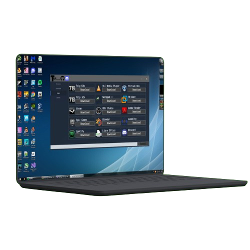

# The-App-Manager

The App Manager – Your One-Stop Solution for Installing Essential Windows Apps!

Tired of searching and installing apps one by one? The App Manager makes it effortless! With just a few clicks, you can install all the must-have apps for your Windows PC—quickly and hassle-free.

Why Choose The App Manager?
✅ Effortless Setup – Install apps in one go, saving you time and effort.
⚡ Lightning-Fast – Optimized for speed, so you get up and running in no time.
💰 Completely Free – No hidden costs, just a smooth and reliable experience.

Get started today and simplify your Windows app installation like never before! 🚀

**Requirements :**
OS:Windows 10 x64 or later
RAM:1GB
STORAGE:200MB

